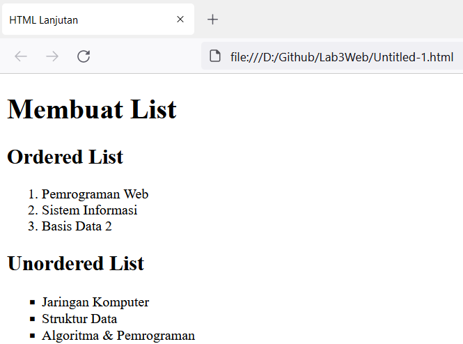

# Lab3Web
Nama  : Bangkit Akbar Anggara 
NIM   : 312010148 
Kelas : TI.20.B.1 

# Tugas
Tugas pemrograman web Lab3Web 
 

# HTML List
Berikut adalah list html yang saya buat kalian bisa mengaksesnya dengan klik tombol disamping: [Click Here](lab3_list.html) 
- Keterangan: 
   1.Untuk tahap awal mari kita membuat tulisan judul atau kalian bebas mengetiknya sesuka hati kalian 
      
     Berikut adalah hasil dari html diatas 
      
   2.Membuat odered list kalian bebas menulis apapun sesuai keinginan kalian jika kalian mau 
      
     Berikut adalah hasil dari odered list 
      
   3.Setelah itu mari kita buat unordered list, kalian bebas mengisi listnya jika kalian mau 
      
     Berikut adalah hasilnya 
      
   4.Lalu kita lanjut description list seperti dibawah ini 
      
     Berikut adalah hasilnya 
      
Dengan begitu selesai sudah kita membuat list html 

# HTML Tabel
Selanjutnya mari kita buat tabel html kalian bisa mengaksesnya dengan klik tombol disamping: [Click Here](lab3_tabel.html) 
- keterangan: 
   1.Kita buat judul dan juga tabelnya 
      
      
     Berikut adalah hasilnya 
      
   2.Setelah itu gabungkan sel data seperti dibawah ini 
      
     Berikut adalah hasilnya setelah digabungkan sel datanya 
      
 Untuk bagian tabel sudah selesai selanjutnya kita buat html form 
 
 # HTML Form
 Terakhir kita buat html form, kalian bisa mengaksesnya dengan klik tombol disamping: [Click Here](lab3_form.html) 
 - Keterangan: 
    1.Kita buat judul dan juga formnya seperti berikut 
       
       
      Berikut adalah hasil dari htmlnya 
       
    2.Selanjutnya kita buat style pada form agar terlihat lebih bagus 
       
      Berikut adalah hasilnya 
       
Dengan begini selesai sudah tugas laporan praktikumnya. 

# Pertanyaan dan Tugas
1. Buatlah form yang menampilkan dropdown menu dan listbox dengan multiple selection. 

# Jawaban
Kalian bisa mengakses htmlnya dengan klik tombol disamping:[Click Here](lab3_jawaban.html) 
 
- Keterangan: 
   - Untuk agama kalian bisa memilih salah satu dari banyaknya pilihan 
   - Lalu untuk Ekskul kalian bisa memilih lebih dari satu dengan cara kalian menekan tombol ctrl pada keyboard laptop kalian 

Sekian dari saya terimakasih 
#### By: Bangkit Akbar Anggara - 312010148 - TI.20.B.1
